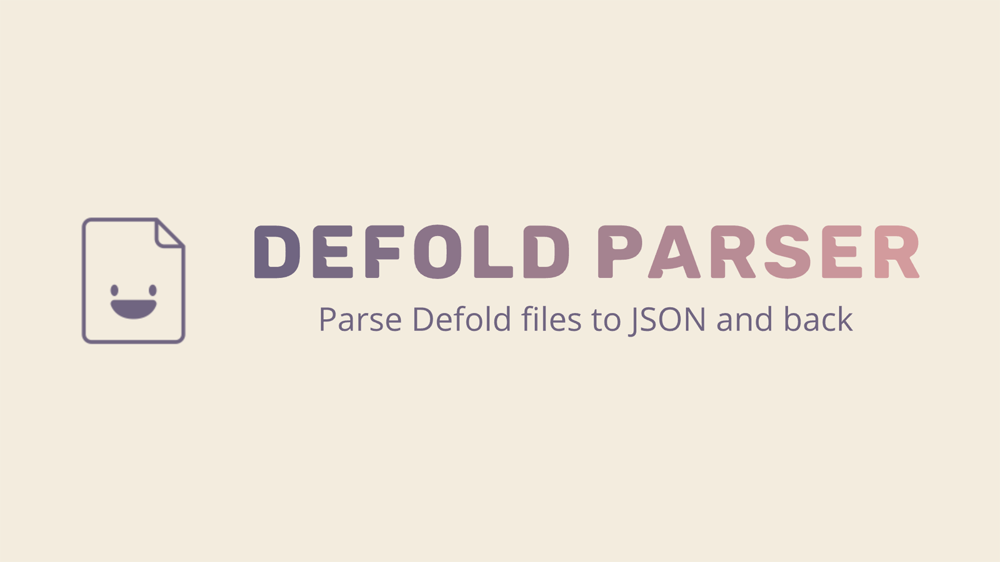

[](https://github.com/sponsors/insality) [](https://ko-fi.com/insality) [](https://www.buymeacoffee.com/insality)
[](https://github.com/Insality/defold-parser/actions/workflows/node.js.yml)
[](https://www.npmjs.com/package/defold-parser)

**Defold Parser** - node module to encode and decode [**Defold**](https://defold.com/) files.


## Install
To install **defold-parser** use [`npm`](https://docs.npmjs.com/).
```bash
npm install --save defold-parser
```

For update **defold-parser** you can use
```bash
npm update --save defold-parser
```

## Usage

Add require line to your `.js` script:
```js
const defold_parser = require("defold-parser")
```
All available API is:
```js
// Parse any Defold file (go, gui, collection, particlefx, etc)
let object = defold_parser.load_from_file([path_to_defold_file])

// Save object to the Defold format
defold_parser.save_to_file([path_to_file], [object])

// You can pass text string directly
let object = defold_parser.decode_object([defold_text_string])

// And get Defold encoded text directly too
let defold_text_string = defold_parser.encode_object([js_object])
```

Every Defold parsed struct is array, even for single fields. To access any field you should access it on first array index. For example:

```js
	let parsed_collection = defold_parser.load_from_file("./tests/files/collection.collection")
	let instance = parsed_collection.embedded_instances[0]

	assert(instance.id[0] == "tile")
	assert(inner_component.id[0] = "sprite")
	assert(inner_component.type[0] = "sprite")
```

To know, which fields you wanna edit, see the file struct you parsing or just use `console.log` in development :smile:

## License

- Developed and supported by [Insality](https://github.com/Insality)


## Issues and suggestions

If you have any issues, questions or suggestions please [create an issue](https://github.com/Insality/defold-parser/issues) or contact me: [insality@gmail.com](mailto:insality@gmail.com)


## ❤️ Support project ❤️

Please support me if you like this project! It will help me keep engaged to update this project.

[](https://github.com/sponsors/insality) [](https://ko-fi.com/insality) [](https://www.buymeacoffee.com/insality)
